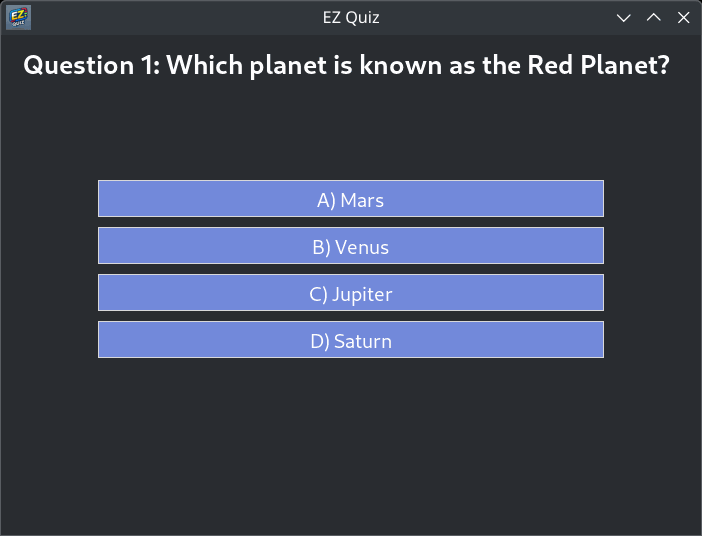

# EZ Quiz Python App

Easily run a quiz from a simple text file. This lightweight Python application allows you to quickly create and take quizzes without any fuss—perfect for informal testing, study sessions, or quick knowledge checks.

[](https://www.python.org/downloads/)
[](LICENSE)

<p align="center">
  
</p>


## Table of Contents

- [Features](#features)
- [Installation](#installation)
- [Usage](#usage)
- [Question File Format](#question-file-format)
- [Customizing](#customizing)
- [Contributing](#contributing)
- [License](#license)

## Features

- **Multiple Question Types:**  
  Supports multiple-choice, true/false, and yes/no questions.
- **Simple File-Based Setup:**  
  Create and edit your quiz questions in a plain text file.
- **Instant Scoring:**  
  See your score immediately after completing the quiz.
- **Detailed Results:**  
  Review which questions you missed along with the correct answers.
- **Dynamic Interface:**  
  A fixed header area with dynamic font adjustment ensures a consistent layout.
- **Standalone Window:**  
  Launches as its own window with a custom icon and WM_CLASS (on Linux) for a separate taskbar entry.
- **Retry Functionality:**  
  Restart your quiz quickly with a dedicated Retry button.

## Installation

### Prerequisites

- **Python 3.x:** Download from [python.org](https://www.python.org/downloads/).
- **Tkinter:**  
  - **Ubuntu/Debian:** `sudo apt-get install python3-tk`
  - **Arch Linux:** `sudo pacman -S tk`
  - **MacOS & Windows:** Tkinter comes bundled with Python.

### Setup

1. **Clone or Download the Repository:**

   ```bash
   git clone https://github.com/yourusername/quiz-app.git
   cd quiz-app
   ```

2. **Prepare Your Question File:**  
   Create a text file (e.g., `questions.txt`) containing your quiz questions as described below.

## Usage

Run the app by executing the following command in your terminal:

```bash
python3 quiz-app.py questions.txt
```

When you launch the application, you’ll see a standalone window with a custom icon. Click on the buttons corresponding to your answers. After completing the quiz, view your score and detailed results, with options to retry or exit.

## Question File Format

Your questions should be written in a plain text file with the following format:

- **Multiple-Choice (MC):**  
  ```
  MC|Question?|A) Option1;B) Option2;...|CorrectOption
  ```
- **True/False (TF):**  
  ```
  TF|Question?|T or F
  ```
- **Yes/No (YN):**  
  ```
  YN|Question?|Y or N
  ```

### Example

```
MC|What color is the sky?|A) Blue;B) Green;C) Yellow;D) Red|A
TF|The Earth is flat.|F
YN|Are apples fruits?|Y
```

## Customizing

- **Generate Questions with ChatGPT:**  
  Quickly generate quiz questions by asking ChatGPT to produce questions in the required format.
- **UI Customization:**  
  The app is built using Tkinter. Feel free to modify the colors, fonts, or layout by editing the source code.
- **Dynamic Font Adjustment:**  
  The header area automatically adjusts the font size if a question spans four or more lines (shrinks from 16pt to 12pt) for a consistent layout.

## Contributing

Contributions are welcome! Since this is a small, open-source project, feel free to fork the repository, add your improvements, and submit a pull request. If you encounter issues or have suggestions, please open an issue on GitHub.

## License

This project is licensed under the **MIT License**. See the [LICENSE](LICENSE) file for details.

---
